# Temas sociales

## Conflicto y cohesión territorial

<!-- ### 8.1 ¿Con qué frecuencia usted/alguien de su hogar se ha molestado o incomodado por problemas con sus vecinos? según ola de estudio -->
```{r confli-olas, fig.align='center', fig.cap='¿Con qué frecuencia usted/alguien de su hogar se ha molestado o incomodado por problemas con sus vecinos? según ola de estudio '}
datos.8.1 <- elsoc_long_2016_2021 %>% 
  filter(tipo_atricion == 1 & muestra == 1 & !t11_01 %in% c(-888, -999) &
           !t11_02 %in% c(-888, -999) & !t11_03 %in% c(-888, -999) & !t11_04 %in% c(-888, -999)) %>% 
  mutate(barrio_confli = (t11_01 + t11_02 + t11_03 + t11_04)/4) %>%
  mutate(barrio_confli_rec = factor(cut(barrio_confli, breaks = c(0,1,2.75,5)),
         labels = c("Nunca","Pocas o algunas veces","Muchas veces o siempre"))) %>%
  sjlabelled::as_label(ola) %>% 
  prop(x = barrio_confli_rec, by = ola, na.rm = TRUE)

g8.1 <- datos.8.1 %>% 
  ggplot(aes(y = prop, x = ola, fill = barrio_confli_rec, 
             label = as.character(scales::percent(prop, accuracy = .1)))) + 
  theme_bw() + 
  geom_col(position = 'Stack') +
  ylab(label = NULL) +
  xlab(label = NULL) +
  scale_fill_viridis_d(begin = .11, end = .88, direction = -1, option = 'viridis') +
  geom_text(position = position_stack(vjust = .5),
            size= 2.75, color = rep(c('black', 'white', 'white'), 5)) + 
  theme(legend.position = 'top', legend.title = element_blank())
g8.1
```

<!-- ### 8.2 Cambios en frecuencia de conflictos barriales -->
```{r confli-cambio, fig.align='center', fig.cap='Cambios en frecuencia de conflictos barriales'}

elsoc_diseno <- elsoc_long_2016_2021 %>% 
  filter(tipo_atricion == 1 & muestra == 1 & ola %in% c(4,5) & !t11_01 %in% c(-888, -999) &
           !t11_02 %in% c(-888, -999) & !t11_03 %in% c(-888, -999) & !t11_04 %in% c(-888, -999)) %>% 
  mutate(barrio_confli = (t11_01 + t11_02 + t11_03 + t11_04)/4) %>%
  mutate(barrio_confli_rec = factor(cut(barrio_confli, breaks = c(0,1,2.75,5)),
         labels = c("Nunca","Pocas o algunas veces","Muchas veces o siempre"))) %>%
  sjlabelled::as_label(ola) %>% 
  survey_design_elsoc()

datos.8.2 <- data.frame((svytable(~barrio_confli_rec + ola + idencuesta, elsoc_diseno, round = F))) %>% 
  dplyr::filter(Freq>0)  %>% 
  group_by(ola) %>% mutate(prop=Freq/sum(Freq)) %>%  
  drop_na()

etiquetas.8.2 <- data.frame((svytable(~barrio_confli_rec + ola, elsoc_diseno, round = F))) %>% 
  group_by(ola) %>% mutate(prop=Freq/sum(Freq)) %>% mutate(idencuesta = 1) %>% 
  drop_na()

g8.2 <- 
  ggplot(datos.8.2, aes(x = ola, fill = barrio_confli_rec, stratum = barrio_confli_rec, 
                           alluvium = idencuesta, y = prop)) +
  ggalluvial::geom_flow(alpha = .66) + 
  ggalluvial::geom_stratum(linetype = 0) +
  scale_y_continuous(labels = scales::percent) + 
  ylab(label = NULL) +
  xlab(label = NULL) + 
  theme(legend.position = 'top',
        legend.title = element_blank()) +
  scale_fill_viridis_d(begin = .11, end = .88, direction = -1, option = 'viridis') +
  geom_text(data = etiquetas.8.2, 
            aes(label = ifelse(prop > 0.03 , scales::percent(prop, accuracy = .1),"")),
            position = position_stack(vjust = .5),
            show.legend = FALSE,
            size = 2.75,
            color = rep(c('black', 'white', 'white'),2))
g8.2
```

<!-- ### 8.3 Porce´´´´´´´´´´´´´´´´´´´´´´´´´´´´´´´´´´´´´´´´´´´´´´´´´´´´´´´´´´´´´´´´´´´{+}egún ola del estudio y zona geográfica. Porcentaje con conflictos barriales "Siempre" o "Muchas veces".  -->
```{r confli-zona, fig.align='center', fig.cap='Porcentaje con alta frecuencia de conflictos barriales, según ola del estudio y zona geográfica. Porcentaje con conflictos barriales "Siempre" o "Muchas veces"'}

datos.8.3 <- elsoc_long_2016_2021 %>% 
  filter(tipo_atricion == 1 & muestra == 1 & ola %in% c(4,5) & !t11_01 %in% c(-888, -999) &
           !t11_02 %in% c(-888, -999) & !t11_03 %in% c(-888, -999) & !t11_04 %in% c(-888, -999)) %>% 
  mutate(barrio_confli = (t11_01 + t11_02 + t11_03 + t11_04)/4) %>%
  mutate( zona1 = factor(car::recode(region_cod, 
                                     "c(1,2,3,4,15)=1; c(5,6,7,8,16)=2; c(9,10,11,12,14)=3; 13=4"),
                        levels = c(1,2,3,4), 
                        labels = c("Norte","Centro","Sur","Metropolitana"))) %>%
  sjlabelled::as_label(ola) %>%
  prop(x = barrio_confli >= 2.76, by = c(ola, zona1), na.rm = TRUE)

g8.3 <- datos.8.3 %>% 
  ggplot(aes(y = prop, x = zona1, fill = ola, 
             label = scales::percent(prop, accuracy = .1))) + 
  theme_bw() + 
  geom_col(position = 'Dodge') +
  scale_y_continuous(labels = scales::percent,
                     limits = c(0, .3)) +
  ylab(label = NULL) +
  xlab(label = NULL) +
  scale_fill_viridis_d(begin = 0, end = .85, direction = -1, option = 'viridis') +
  theme(legend.position = 'top',
        legend.title = element_blank()) +
  geom_text(vjust = -0.8,
            position = position_dodge(width = .9),
            size= 2.75)
g8.3
```

<!-- ### 8.4 Porcentaje con alta frecuencia de conflictos barriales, según ola del estudio y zona de residencia. Porcentaje con conflictos barriales "Siempre" o "Muchas veces".  -->
```{r confli-estrato, fig.align='center', fig.cap='Porcentaje con alta frecuencia de conflictos barriales, según ola del estudio y zona de residencia. Porcentaje con conflictos barriales "Siempre" o "Muchas veces".'}

datos.8.4 <- elsoc_long_2016_2021 %>% 
  filter(tipo_atricion == 1 & muestra == 1 & ola %in% c(4,5) & !t11_01 %in% c(-888, -999) &
           !t11_02 %in% c(-888, -999) & !t11_03 %in% c(-888, -999) & !t11_04 %in% c(-888, -999)) %>% 
  mutate(barrio_confli = (t11_01 + t11_02 + t11_03 + t11_04)/4) %>%
  mutate(barrio_confli_rec = factor(cut(barrio_confli, breaks = c(0,1,2.75,5)),
         labels = c("Nunca","Pocas o algunas veces","Muchas veces o siempre")),
         estrato = factor(estrato, levels = c(1,2,3,4,5,6),
         labels = c('Gran\nSantiago', 'Gran\nValparaíso', 'Gran\nConcepción', 
                    'Ciudades\ngrandes', 'Ciudades\nmedianas', 'Ciudades\npequeñas'))) %>%
  sjlabelled::as_label(ola) %>% 
  prop(x = barrio_confli_rec, by = c(ola, estrato), na.rm = TRUE) %>% 
  filter(barrio_confli_rec == 'Muchas veces o siempre')

g8.4 <- datos.8.4 %>% 
  ggplot(aes(y = prop, x = estrato, fill = ola, 
             label = as.character(scales::percent(prop, accuracy = .1)))) + 
  theme_bw() + 
  geom_col(position = 'Dodge') +
  scale_y_continuous(labels = scales::percent,
                     limits = c(0, .3)) +
  ylab(label = NULL) +
  xlab(label = NULL) +
  scale_fill_viridis_d(begin = 0, end = .85, direction = -1, option = 'viridis') +
  theme(legend.position = 'top',
        legend.title = element_blank()) +
  geom_text(vjust = -0.8,
            position = position_dodge(width = .9),
            size= 2.75)
g8.4
```


<!-- ### 8.5 Porcentaje con alta frecuencia de conflictos barriales, según ola del estudio y quintil de ingreso. Porcentaje con conflictos barriales "Siempre" o "Muchas veces".  -->
```{r confli-quintil, fig.align='center', fig.cap='Porcentaje con alta frecuencia de conflictos barriales, según ola del estudio y quintil de ingreso. Porcentaje con conflictos barriales "Siempre" o "Muchas veces".'}
datos.8.5 <- elsoc_long_2016_2021 %>% 
  filter(tipo_atricion == 1 & muestra == 1 & ola %in% c(4,5) & !t11_01 %in% c(-888, -999) &
           !t11_02 %in% c(-888, -999) & !t11_03 %in% c(-888, -999) & !t11_04 %in% c(-888, -999)) %>% 
  mutate(barrio_confli = (t11_01 + t11_02 + t11_03 + t11_04)/4,
         m30 = as.numeric(car::recode(m30,"1=110000;2=251000;3=305000;4=355000;5=400000;
                                           6=445000;7=490000;8=535000;9=585000;10=640000;11=700000;12=765000;
                                           13=845000;14=935000;15=1040000;16=1180000;17=1375000;18=1670000;
                                           19=2275000;20=2700000;NA=NA")),
         m29_imp = ifelse(!is.na(m29),m29, m30),
         n_hogar = case_when(ola == 1 ~ nhogar1, ola == 2 ~ m46_nhogar,
                             ola == 3 ~ m54, ola == 4 ~ m54, ola == 5 ~ m54)) %>%
  mutate(ing_pc = (m29_imp/n_hogar)) %>%
  sjlabelled::as_label(ola) %>% 
  group_by(ola) %>% 
  mutate(quintil = factor(ntile(-desc(ing_pc), 5), levels = c(1,2,3,4,5),
         labels = c('Q1', 'Q2', 'Q3', 'Q4', 'Q5'))) %>% 
  prop(x = barrio_confli >= 2.76, by = c(ola, quintil), na.rm = TRUE)

g8.5 <- datos.8.5 %>% 
  ggplot(aes(y = prop, x = quintil, fill = ola, 
             label = as.character(scales::percent(prop, accuracy = .1)))) + 
  theme_bw() + 
  geom_col(position = 'Dodge') +
  scale_y_continuous(labels = scales::percent,
                     limits = c(0, .3)) +
  ylab(label = NULL) +
  xlab(label = NULL) +
  scale_fill_viridis_d(begin = 0, end = .85, direction = -1, option = 'viridis') +
  theme(legend.position = 'top',
        legend.title = element_blank()) +
  geom_text(vjust = -0.8,
            position = position_dodge(width = .9),
            size= 2.75)
g8.5
```

### Cartografía del conflicto barrial

```{r confli-comuna, fig.align='center', fig.cap='Frecuencia promedio de problemas con vecinos, según comuna de residencia en la región metropolitana (2021).'}

elsoc_comuna_rm <- elsoc_long_2016_2021 %>% 
  filter(tipo_atricion == 1 & muestra == 1 & ola == 5 & region_cod == 13 & !t11_01 %in% c(-888, -999) &
           !t11_02 %in% c(-888, -999) & !t11_03 %in% c(-888, -999) & !t11_04 %in% c(-888, -999)) %>% 
  mutate(barrio_confli = (t11_01 + t11_02 + t11_03 + t11_04)/4) %>%
  sjlabelled::as_label(ola) %>% 
  group_by(comuna, comuna_cod) %>% 
  summarise(m_confli = weighted.mean(barrio_confli, ponderador02, na.rm = T)) %>% 
  ungroup() 

comunas_rm <- chilemapas::mapa_zonas %>%   
  dplyr::filter(codigo_region == '13' & codigo_provincia == '131') %>% 
  st_as_sf(.) %>% 
  group_by(codigo_comuna) %>% 
  summarise() %>% 
  ungroup() %>% 
  mutate(comuna_cod = as.numeric(codigo_comuna)) %>% 
  left_join(elsoc_comuna_rm, by = 'comuna_cod')

g.confli.rm <- comunas_rm %>%
  ggplot() + 
  geom_sf(aes(fill = m_confli, geometry = geometry)) +
  labs(y = NULL, x = NULL, fill = "Conflictividad barrial\npromedio por comuna") +
  scale_fill_viridis_c(begin = .11, end = .88, direction = -1, option = 'viridis') +
  theme_bw()
g.confli.rm
```

```{r confli-region2, fig.align='center', fig.cap='Frecuencia promedio de problemas con vecinos, según región de Chile (2021)', message=FALSE, warning=FALSE}

elsoc_region <- elsoc_long_2016_2021 %>% 
  filter(tipo_atricion == 1 & muestra == 1 & ola == 5 & !t11_01 %in% c(-888, -999) &
           !t11_02 %in% c(-888, -999) & !t11_03 %in% c(-888, -999) & !t11_04 %in% c(-888, -999)) %>% 
  mutate(barrio_confli = (t11_01 + t11_02 + t11_03 + t11_04)/4) %>%
  sjlabelled::as_label(ola) %>% 
  group_by(region, region_cod) %>% 
  summarise(m_confli = weighted.mean(barrio_confli, ponderador02, na.rm = T),
            sd_confli = sd(barrio_confli, na.rm = T),
            n = n())

elsoc_region$region_cod <- factor(elsoc_region$region_cod,
                                  labels = c('01','02','03','04','05','06','07','08',
                                            '09','10','11','13','14','15','16'))

regiones <- chilemapas::generar_regiones()
regiones <- merge(regiones,elsoc_region, by.x="codigo_region",by.y="region_cod",all.x=TRUE,sort=F)

#para intentar hacer facet_wrap
#regiones$mitad <- c('1','1','1','1','1','1','1','2','2','2','2','1','2','1','2','2')

regiones$region[is.na(regiones$region)] <- 'Magallanes\n(Sin datos)'
regiones$region[regiones$region == 'Metropolitana de santiago'] <- 'Metropolitana'
regiones$region[regiones$region == 'Libertador general bernardo ohiggins'] <- 'Ohiggins'
regiones$region[regiones$region == 'Aysen del general carlos ibannez del campo'] <- 'Aysen'
regiones$region[regiones$region == 'Arica y parinacota'] <- 'Arica'

g.confli.region <- regiones %>% 
  ggplot(aes(fill = m_confli, geometry = geometry, label = region)) + 
  geom_sf() +
  coord_sf(xlim = c(-100, -65)) +
  labs(y = NULL, x = NULL, fill = "Conflictividad barrial\npromedio por región") +
  scale_fill_viridis_c(begin = .11, end = .88, direction = -1, option = 'viridis', na.value = 'white') +
  ggrepel::geom_text_repel(stat = "sf_coordinates", min.segment.length = 0,
                           colour = "black", segment.colour = "black",
                           direction = "y", hjust = 2.5, size = 3) +
  ggspatial::annotation_north_arrow(aes(which_north = "true", location = "bl"), pad_y = unit(0.8, "cm")) +
  ggspatial::annotation_scale(aes(location = "bl", style = "bar")) +
  theme_bw()
g.confli.region
```

## Confianza en vecinos

<!-- ### 8.6 En términos generales, ¿cuánto confía usted en sus vecinos? según ola de estudio -->
```{r vecinos-ola, fig.align='center', fig.cap='En términos generales, ¿cuánto confía usted en sus vecinos? según ola de estudio.'}
datos.8.6 <- elsoc_long_2016_2021 %>% 
  filter(tipo_atricion == 1 & muestra == 1 & !t01 %in% c(-888, -999)) %>% 
  mutate(barrio_conf = factor(car::recode(t01, "c(1,2) = 1; c(3) = 2; c(4,5) = 3"),
                               levels = c(1,2,3),
                               labels = c('Muy poco o poco', 'Algo', 'Bastante o mucho'))) %>%
  sjlabelled::as_label(ola) %>%
  prop(x = barrio_conf, by = ola, na.rm = TRUE)

g8.6 <- datos.8.6 %>% 
  ggplot(aes(y = prop, x = ola, fill = barrio_conf, 
             label = as.character(scales::percent(prop, accuracy = .1)))) + 
  theme_bw() + 
  geom_col(position = 'Stack') +
  ylab(label = NULL) +
  xlab(label = NULL) +
  scale_fill_viridis_d(begin = .11, end = .88, direction = 1, option = 'viridis') +
  geom_text(position = position_stack(vjust = .5),
            size= 2.75, color = rep(c('white', 'white', 'black'), 5)) + 
  theme(legend.position = 'top',
        legend.title = element_blank())
g8.6
```

<!-- ### 8.7 En términos generales, ¿cuánto confía usted en sus vecinos? Según ola del estudio y zona geográfica. Suma de Respuestas “Bastante” y “Mucho”.  -->
```{r vecinos-zona, fig.align='center', fig.cap='En términos generales, ¿cuánto confía usted en sus vecinos? Según ola del estudio y zona geográfica. Suma de Respuestas “Bastante” y “Mucho”.'}
datos.8.7 <- elsoc_long_2016_2021 %>% 
  filter(tipo_atricion == 1 & muestra == 1 & ola %in% c(4,5) & !t01 %in% c(-888, -999)) %>% 
  mutate(zona1 = factor(car::recode(region_cod, 
                                    "c(1,2,3,4,15)=1; c(5,6,7,8,16)=2; c(9,10,11,12,14)=3; 13=4"),
                        levels = c(1,2,3,4), 
                        labels = c("Norte","Centro","Sur","Metropolitana")))%>%
  sjlabelled::as_label(ola) %>%
  prop(x = t01 %in% c(4, 5), by = c(ola, zona1), na.rm = TRUE) 

g8.7 <- datos.8.7 %>% 
  ggplot(aes(y = prop, x = zona1, fill = ola, 
             label = scales::percent(prop, accuracy = .1))) + 
  theme_bw() + 
  geom_col(position = 'Dodge') +
  scale_y_continuous(labels = scales::percent,
                     limits = c(0, 1)) +
  ylab(label = NULL) +
  xlab(label = NULL) +
  scale_fill_viridis_d(begin = 0, end = .85, direction = -1, option = 'viridis') +
  theme(legend.position = 'top',
        legend.title = element_blank()) +
  geom_text(vjust = -0.8,
            position = position_dodge(width = .9),
            size= 2.75)
g8.7
```

<!-- ### 8.8 En términos generales, ¿cuánto confía usted en sus vecinos? Según ola del estudio y quintil de ingreso. Suma de Respuestas “Bastante” y “Mucho”. -->
```{r vecinos-quintil, fig.align='center', fig.cap='En términos generales, ¿cuánto confía usted en sus vecinos? Según ola del estudio y quintil de ingreso. Suma de Respuestas “Bastante” y “Mucho”.'}
datos.8.8 <- elsoc_long_2016_2021 %>% 
  filter(tipo_atricion == 1 & muestra == 1 & ola %in% c(4,5) & !t01 %in% c(-888, -999)) %>% 
  mutate(m30 = as.numeric(car::recode(m30,"1=110000;2=251000;3=305000;4=355000;5=400000;
                                           6=445000;7=490000;8=535000;9=585000;10=640000;11=700000;12=765000;
                                           13=845000;14=935000;15=1040000;16=1180000;17=1375000;18=1670000;
                                           19=2275000;20=2700000;NA=NA")),
         m30b = as.numeric(car::recode(m30b, "1 = 125000; 2 = 300000; 3 = 400000; 4 = 620000; 5 = 1100000; NA = NA")),
         m29_imp = ifelse(!is.na(m29), m29, ifelse(ola == 5, m30b ,m30)),
         n_hogar = case_when(ola == 1 ~ nhogar1, ola == 2 ~ m46_nhogar,
                             ola == 3 ~ m54, ola == 4 ~ m54, ola == 5 ~ m54),
         ing_pc = (m29_imp/n_hogar)) %>%
  group_by(ola) %>% 
  mutate(quintil = factor(ntile(-desc(ing_pc), 5), 
                          levels = c(1,2,3,4,5),
                          labels = c('Q1', 'Q2', 'Q3', 'Q4', 'Q5'))) %>% 
  prop(x = t01 %in% c(4, 5), by = c(ola, quintil), na.rm = TRUE) %>% 
  sjlabelled::as_label(ola)

g8.8 <- datos.8.8 %>% 
  ggplot(aes(y = prop, x = quintil, fill = ola, 
             label = scales::percent(prop, accuracy = .1))) + 
  theme_bw() + 
  geom_col(position = 'Dodge') +
  scale_y_continuous(labels = scales::percent,
                     limits = c(0, 1)) +
  ylab(label = NULL) +
  xlab(label = NULL) +
  scale_fill_viridis_d(begin = 0, end = .85, direction = -1, option = 'viridis') +
  theme(legend.position = 'top',
        legend.title = element_blank()) +
  geom_text(vjust = -0.8,
            position = position_dodge(width = .9),
            size= 2.75)
g8.8
```


### Seguridad barrial

<!-- ### 8.9 ¿Qué tan seguro o inseguro se siente en el barrio o vecindario donde usted vive? Según ola del estudio. -->
```{r seguri-ola, fig.align='center', fig.cap='¿Qué tan seguro o inseguro se siente en el barrio o vecindario donde usted vive? Según ola del estudio.'}
datos.8.9 <- elsoc_long_2016_2021 %>% 
  filter(tipo_atricion == 1 & muestra == 1 & !t10 %in% c(-888, -999)) %>% 
  mutate(barrio_segur = factor(car::recode(t10, "c(1,2)=1; c(3)=2; c(4,5)=3"), levels = c(1,2,3),
                               labels = c('Muy inseguro o inseguro', 'Ni seguro ni inseguro',
                                          'Seguro o Muy seguro'))) %>%
  sjlabelled::as_label(ola) %>%
  prop(x = barrio_segur, by = ola, na.rm = TRUE)

g8.9 <- datos.8.9 %>% 
  ggplot(aes(y = prop, x = ola, fill = barrio_segur, 
             label = as.character(scales::percent(prop, accuracy = .1)))) + 
  theme_bw() + 
  geom_col(position = 'Stack') +
  ylab(label = NULL) +
  xlab(label = NULL) +
  scale_fill_viridis_d(begin = .11, end = .88, direction = 1, option = 'viridis') +
  geom_text(position = position_stack(vjust = .5),
            size= 2.75, color = rep(c('white', 'white', 'black'), 5)) + 
  theme(legend.position = 'top',
        legend.title = element_blank())
g8.9
```

<!-- ### 8.10 ¿Qué tan seguro o inseguro se siente en el barrio o vecindario donde usted vive? Según ola del estudio y zona geográfica. Suma de Respuestas "Inseguro" o ”Muy Inseguro".  -->

```{r seguri-zona, fig.align='center',fig.cap='¿Qué tan seguro o inseguro se siente en el barrio o vecindario donde usted vive? Según ola del estudio y zona geográfica. Suma de Respuestas "Inseguro" o ”Muy Inseguro".'}

datos.8.10 <- elsoc_long_2016_2021 %>% 
  filter(tipo_atricion == 1 & muestra == 1 & !t10 %in% c(-888, -999)) %>% 
  mutate(zona1 = factor(car::recode(region_cod, 
                                    "c(1,2,3,4,15)=1; c(5,6,7,8,16)=2; c(9,10,11,12,14)=3; 13=4"),
                        levels = c(1,2,3,4), 
                        labels = c("Norte","Centro","Sur","Metropolitana")))%>%
  prop(x = t10 %in% c(1, 2), by = c(ola, zona1), na.rm = TRUE) %>% 
  sjlabelled::as_label(ola)

g8.10 <- datos.8.10 %>% 
  ggplot(aes(y = prop, x = ola, color = zona1, group = zona1,
             label = as.character(scales::percent(prop, accuracy = .1)))) +
  theme_bw() +   
  geom_line(size = 1) +
  geom_point(size = 1.8) +
  scale_y_continuous(labels = scales::percent,
                     limits = c(0,.5)) +
  ylab(label = NULL) +
  xlab(label = NULL) +
  scale_color_viridis_d(begin = 0, end = .77, direction = -1, option = 'viridis') +
  ggrepel::geom_text_repel(size = 3) +
  theme(legend.position = 'top',
        legend.title = element_blank())
g8.10
```

<!-- ### 8.11 ¿Qué tan seguro o inseguro se siente en el barrio o vecindario donde usted vive? Según ola del estudio y nivel educacional. Suma de Respuestas "Inseguro" o ”Muy Inseguro". -->
```{r seguri-educ, fig.align='center',fig.cap='¿Qué tan seguro o inseguro se siente en el barrio o vecindario donde usted vive? Según ola del estudio y nivel educacional. Suma de Respuestas "Inseguro" o ”Muy Inseguro".'}

datos.8.11 <- elsoc_long_2016_2021 %>% 
  filter(tipo_atricion == 1 & muestra == 1 & !t10 %in% c(-888, -999) & !m01 %in% c(-888, -999)) %>% 
  mutate(educ = factor(car::recode(m01,
                                   "c(1,2,3)=1; c(4,5)=2; c(6,7)=3; c(8,9,10)=4"),
                        levels = c(1,2,3,4), 
                       labels = c("Basica","Media","Tecnica","Universitaria"))) %>%
  prop(x = t10 %in% c(1, 2), by = c(ola, educ), na.rm = TRUE) %>% 
  sjlabelled::as_label(ola)

g8.11 <- datos.8.11 %>% 
  ggplot(aes(y = prop, x = ola, color = educ, group = educ,
             label = as.character(scales::percent(prop, accuracy = .1)))) +
  theme_bw() +   
  geom_line(size = 1) +
  geom_point(size = 1.8) +
  scale_y_continuous(labels = scales::percent,
                     limits = c(0,.5)) +
  ylab(label = NULL) +
  xlab(label = NULL) +
  scale_color_viridis_d(begin = 0, end = .77, direction = -1, option = 'viridis') +
  ggrepel::geom_text_repel(size = 3) +
  theme(legend.position = 'top',
        legend.title = element_blank())
g8.11
```

<!-- ### 8.12 ¿Qué tan seguro o inseguro se siente en el barrio o vecindario donde usted vive? Según ola del estudio y tramos de edad. Suma de Respuestas "Inseguro" o ”Muy Inseguro". -->
```{r seguri-edad, fig.align='center',fig.cap='¿Qué tan seguro o inseguro se siente en el barrio o vecindario donde usted vive? Según ola del estudio y tramos de edad. Suma de Respuestas "Inseguro" o ”Muy Inseguro".'}
datos.8.12 <- elsoc_long_2016_2021 %>% 
  filter(tipo_atricion == 1 & muestra == 1 & !t10 %in% c(-888, -999)) %>% 
  mutate(edadt = factor(car::recode(m0_edad, 
                                    "18:29=1;30:49=2;50:64=3;65:150=4"),
                        levels = c(1,2,3,4), 
                        labels = c('18-29', '30-49', '50-64', '65 o más'))) %>%
  sjlabelled::as_label(ola) %>%
  prop(x = t10 %in% c(1,2), by = c(ola, edadt), na.rm = TRUE)

g8.12 <- datos.8.12 %>% 
  ggplot(aes(y = prop, x = ola, color = edadt, group = edadt,
             label = as.character(scales::percent(prop, accuracy = .1)))) +
  theme_bw() +   
  geom_line(size = 1) +
  geom_point(size = 1.8) +
  scale_y_continuous(labels = scales::percent,
                     limits = c(0,.5)) +
  ylab(label = NULL) +
  xlab(label = NULL) +
  scale_color_viridis_d(begin = 0, end = .77, direction = -1, option = 'viridis') +
  ggrepel::geom_text_repel(size = 3) +
  theme(legend.position = 'top',
        legend.title = element_blank())
g8.12
```

<!-- ### 8.13 ¿Qué tan seguro o inseguro se siente en el barrio o vecindario donde usted vive? Según ola del estudio y quintil de ingreso per capita. Suma de Respuestas "Seguro" o ”Muy Seguro". -->
```{r seguri-quintil, fig.align='center',fig.cap='¿Qué tan seguro o inseguro se siente en el barrio o vecindario donde usted vive? Según ola del estudio y quintil de ingreso per capita. Suma de Respuestas "Seguro" o ”Muy Seguro".'}

datos.8.13 <- elsoc_long_2016_2021 %>% 
  filter(tipo_atricion == 1 & muestra == 1 & !t10 %in% c(-888, -999)) %>% 
  mutate(barrio_segur = factor(car::recode(t10, "c(1,2)=1; c(3)=2; c(4,5)=3"), levels = c(1,2,3),
                               labels = c('Muy inseguro o inseguro', 'Ni seguro ni inseguro',
                                          'Seguro o Muy seguro')),
         m30 = as.numeric(car::recode(m30,"1=110000;2=251000;3=305000;4=355000;5=400000;
                                           6=445000;7=490000;8=535000;9=585000;10=640000;11=700000;12=765000;
                                           13=845000;14=935000;15=1040000;16=1180000;17=1375000;18=1670000;
                                           19=2275000;20=2700000;NA=NA")),
         m29_imp = ifelse(!is.na(m29),m29, m30),
         n_hogar = case_when(ola == 1 ~ nhogar1, ola == 2 ~ m46_nhogar,
                             ola == 3 ~ m54, ola == 4 ~ m54, ola == 5 ~ m54)) %>%
  mutate(ing_pc = (m29_imp/n_hogar)) %>%
  sjlabelled::as_label(ola) %>% 
  group_by(ola) %>% 
  mutate(quintil = factor(ntile(-desc(ing_pc), 5), levels = c(1,2,3,4,5),
         labels = c('Q1', 'Q2', 'Q3', 'Q4', 'Q5'))) %>% 
  prop(x = barrio_segur, by = c(ola, quintil), na.rm = TRUE) %>% 
  filter(barrio_segur == 'Muy inseguro o inseguro', quintil == "Q1" | quintil == "Q5") %>% 
  drop_na()

g8.13 <- datos.8.13 %>% 
  ggplot(aes(y = prop, x = ola, color = quintil, group = quintil,
             label = as.character(scales::percent(prop, accuracy = .1)))) +
  theme_bw() +   
  geom_line(size = 1) +
  geom_point(size = 1.8) +
  scale_y_continuous(labels = scales::percent,
                     limits = c(0,.5)) +
  ylab(label = NULL) +
  xlab(label = NULL) +
  scale_color_viridis_d(begin = .0, end = .55, direction = -1, option = 'viridis') +
  geom_text(vjust = -0.8,
            size= 2.75) +
  theme(legend.position = 'top',
        legend.title = element_blank())
g8.13
```

### Criminalidad barrial

<!-- ### 8.14 ¿Con qué frecuencia se han producido crímenes (riñas, robos y tráfico de drogas) en su barrio?, según ola de estudio. -->
```{r crim-olas, fig.align='center', fig.cap='¿Con qué frecuencia se han producido crímenes (riñas, robos y tráfico de drogas) en su barrio?, según ola de estudio.'}
datos.8.14 <- elsoc_long_2016_2021 %>% 
  filter(tipo_atricion == 1 & muestra == 1 &
           !t09_01 %in% c(-888, -999) & !t09_02 %in% c(-888, -999) & !t09_03 %in% c(-888, -999)) %>% 
  mutate(barrio_crim = (t09_01 + t09_02 + t09_03)/3) %>% 
  mutate(barrio_crim_rec = factor(cut(barrio_crim, breaks = c(0,1,2.67,5)),
                                  labels = c("Nunca","Pocas o algunas veces","Muchas veces o siempre"))) %>%
  sjlabelled::as_label(ola) %>% 
  prop(x = barrio_crim_rec, by = ola, na.rm = TRUE)

g8.14 <- datos.8.14 %>% 
  ggplot(aes(y = prop, x = ola, fill = barrio_crim_rec, 
             label = as.character(scales::percent(prop, accuracy = .1)))) + 
  theme_bw() + 
  geom_col(position = 'Stack') +
  ylab(label = NULL) +
  xlab(label = NULL) +
  scale_fill_viridis_d(begin = .11, end = .88, direction = -1, option = 'viridis') +
  geom_text(position = position_stack(vjust = .5),
            size= 2.75, color = rep(c('black', 'white', 'white'), 5)) + 
  theme(legend.position = 'top', legend.title = element_blank())
g8.14
```

<!-- ### 8.15 ¿Con qué frecuencia se han producido crímenes (riñas, robos y tráfico de drogas) en su barrio?, según ola del estudio y zona geográfica. Porcentaje de experiencias de criminalidad "Siempre" o "Muchas veces".  -->
```{r crim-zona, fig.align='center', fig.cap='¿Con qué frecuencia se han producido crímenes (riñas, robos y tráfico de drogas) en su barrio?, según ola del estudio y zona geográfica. Porcentaje de experiencias de criminalidad "Siempre" o "Muchas veces".'}
datos.8.15 <- elsoc_long_2016_2021 %>% 
  filter(tipo_atricion == 1 & muestra == 1 & ola %in% c(4,5) &
           !t09_01 %in% c(-888, -999) & !t09_02 %in% c(-888, -999) & !t09_03 %in% c(-888, -999)) %>% 
  mutate(barrio_crim = (t09_01 + t09_02 + t09_03)/3) %>% 
  mutate(barrio_crim_rec = factor(cut(barrio_crim, breaks = c(0,1,2.67,5)),
                                  labels = c("Nunca","Pocas o algunas veces","Muchas veces o siempre")),
         zona1 = factor(car::recode(region_cod, "c(1,2,3,4,15)=1; c(5,6,7,8,16)=2; c(9,10,11,12,14)=3; 13=4"),
                        levels = c(1,2,3,4), labels = c("Norte","Centro","Sur","Metropolitana"))) %>%
  sjlabelled::as_label(ola) %>% 
  prop(x = barrio_crim_rec, by = c(ola, zona1), na.rm = TRUE) %>% 
  filter(barrio_crim_rec == 'Muchas veces o siempre')

g8.15 <- datos.8.15 %>% 
  ggplot(aes(y = prop, x = zona1, fill = ola, 
             label = as.character(scales::percent(prop, accuracy = .1)))) + 
  theme_bw() + 
  geom_col(position = 'Dodge') +
  scale_y_continuous(labels = scales::percent,
                     limits = c(0, .5)) +
  ylab(label = NULL) +
  xlab(label = NULL) +
  scale_fill_viridis_d(begin = 0, end = .85, direction = -1, option = 'viridis') +
  theme(legend.position = 'top',
        legend.title = element_blank()) +
  geom_text(vjust = -0.8,
            position = position_dodge(width = .9),
            size= 2.75)
g8.15
```

<!-- ### 8.16 ¿Con qué frecuencia se han producido crímenes (riñas, robos y tráfico de drogas) en su barrio?, según ola del estudio y tipo de ciudad. Porcentaje de experiencias de criminalidad "Siempre" o "Muchas veces".  -->
```{r crim-estrato, fig.align='center', fig.cap='¿Con qué frecuencia se han producido crímenes (riñas, robos y tráfico de drogas) en su barrio?, según ola del estudio y tipo de ciudad. Porcentaje de experiencias de criminalidad "Siempre" o "Muchas veces".'}
datos.8.16 <- elsoc_long_2016_2021 %>% 
  filter(tipo_atricion == 1 & muestra == 1 & ola %in% c(4,5) &
           !t09_01 %in% c(-888, -999) & !t09_02 %in% c(-888, -999) & !t09_03 %in% c(-888, -999)) %>% 
  mutate(barrio_crim = (t09_01 + t09_02 + t09_03)/3) %>% 
  mutate(barrio_crim_rec = factor(cut(barrio_crim, breaks = c(0,1,2.67,5)),
                                  labels = c("Nunca","Pocas o algunas veces","Muchas veces o siempre")),
         estrato = factor(estrato, levels = c(1,2,3,4,5,6),
                          labels = c('Gran\nSantiago', 'Gran\nValparaíso', 'Gran\nConcepción',
                                     'Ciudades\ngrandes', 'Ciudades\nmedianas', 'Ciudades\npequeñas'))) %>%
  sjlabelled::as_label(ola) %>% 
  prop(x = barrio_crim_rec, by = c(ola, estrato), na.rm = TRUE) %>% 
  filter(barrio_crim_rec == 'Muchas veces o siempre')

g8.16 <- datos.8.16 %>% 
  ggplot(aes(y = prop, x = estrato, fill = ola, 
             label = as.character(scales::percent(prop, accuracy = .1)))) + 
  theme_bw() + 
  geom_col(position = 'Dodge') +
  scale_y_continuous(labels = scales::percent,
                     limits = c(0, .5)) +
  ylab(label = NULL) +
  xlab(label = NULL) +
  scale_fill_viridis_d(begin = 0, end = .85, direction = -1, option = 'viridis') +
  theme(legend.position = 'top',
        legend.title = element_blank()) +
  geom_text(vjust = -0.8,
            position = position_dodge(width = .9),
            size= 2.75)
g8.16
```

<!-- ### 8.17 ¿Con qué frecuencia se han producido crímenes (riñas, robos y tráfico de drogas) en su barrio?, según ola del estudio y quintil de ingreso. Porcentaje de experiencias de criminalidad "Siempre" o "Muchas veces".  -->
```{r crim-quintil, fig.align='center', fig.cap='¿Con qué frecuencia se han producido crímenes (riñas, robos y tráfico de drogas) en su barrio?, según ola del estudio y quintil de ingreso. Porcentaje de experiencias de criminalidad "Siempre" o "Muchas veces".'}

datos.8.17 <- elsoc_long_2016_2021 %>% 
  filter(tipo_atricion == 1 & muestra == 1 &
           !t09_01 %in% c(-888, -999) & !t09_02 %in% c(-888, -999) & !t09_03 %in% c(-888, -999)) %>% 
  mutate(barrio_crim = (t09_01 + t09_02 + t09_03)/3) %>% 
  mutate(barrio_crim_rec = factor(cut(barrio_crim, breaks = c(0,1,2.67,5)),
                                  labels = c("Nunca","Pocas o algunas veces","Muchas veces o siempre")),
         m30 = as.numeric(car::recode(m30,"1=110000;2=251000;3=305000;4=355000;5=400000;
                                           6=445000;7=490000;8=535000;9=585000;10=640000;11=700000;12=765000;
                                           13=845000;14=935000;15=1040000;16=1180000;17=1375000;18=1670000;
                                           19=2275000;20=2700000;NA=NA")),
         m29_imp = ifelse(!is.na(m29),m29, m30),
         n_hogar = case_when(ola == 1 ~ nhogar1, ola == 2 ~ m46_nhogar,
                             ola == 3 ~ m54, ola == 4 ~ m54, ola == 5 ~ m54)) %>%
  mutate(ing_pc = (m29_imp/n_hogar)) %>%
  sjlabelled::as_label(ola) %>% 
  group_by(ola) %>% 
  mutate(quintil = factor(ntile(-desc(ing_pc), 5), levels = c(1,2,3,4,5),
         labels = c('Q1', 'Q2', 'Q3', 'Q4', 'Q5'))) %>% 
  prop(x = barrio_crim_rec, by = c(ola, quintil), na.rm = TRUE) %>% 
  filter(barrio_crim_rec == 'Muchas veces o siempre', quintil == "Q1" | quintil == "Q5") 

g8.17 <- datos.8.17 %>% 
  ggplot(aes(y = prop, x = ola, color = quintil, group = quintil,
             label = as.character(scales::percent(prop, accuracy = .1)))) +
  theme_bw() +   
  geom_line(size = 1) +
  geom_point(size = 1.8) +
  scale_y_continuous(labels = scales::percent,
                     limits = c(0,.6)) +
  ylab(label = NULL) +
  xlab(label = NULL) +
  scale_color_viridis_d(begin = .0, end = .55, direction = -1, option = 'viridis') +
  geom_text(vjust = -0.8,
            size= 2.75) +
  theme(legend.position = 'top',
        legend.title = element_blank())
g8.17
```
### Cartografía de la criminalidad barrial

```{r crimi-comuna, fig.align='center', fig.cap='Frecuencia promedio de percepción de crímenes (riñas, robos y tráfico de drogas) en el barrio, según comuna de residencia en la región metropolitana (2021).'}

elsoc_comuna_rm <- elsoc_long_2016_2021 %>% 
  filter(tipo_atricion == 1 & muestra == 1 & ola == 5 & region_cod == 13 & !t09_01 %in% c(-888, -999) &
           !t09_02 %in% c(-888, -999) & !t09_03 %in% c(-888, -999)) %>% 
  mutate(barrio_crim = (t09_01 + t09_02 + t09_03)/3) %>%
  sjlabelled::as_label(ola) %>% 
  group_by(comuna, comuna_cod) %>% 
  summarise(m_crim = weighted.mean(barrio_crim, ponderador02, na.rm = T),
            sd_crim = sd(barrio_crim, na.rm = T),
            n = n())

comunas_rm <- chilemapas::mapa_zonas %>% 
  filter(codigo_region==13 & codigo_provincia == '131') %>% 
  st_as_sf(.) %>% 
  group_by(codigo_comuna) %>% 
  summarise()

comunas_rm <- merge(comunas_rm, 
                    elsoc_comuna_rm, 
                    by.x = "codigo_comuna", by.y = "comuna_cod",
                    all.x = TRUE,
                    sort=F)

#comunas_rm <- comunas_rm %>% drop_na() #en caso de quitar comunas con NA

g.crimi.rm <- 
  ggplot(comunas_rm) + 
  geom_sf(aes(fill = m_crim, geometry = geometry)) +
  labs(y = NULL, x = NULL, fill = "Criminalidad barrial\npromedio por comuna") +
  scale_fill_viridis_c(begin = .11, end = .88, direction = -1, option = 'viridis') +
  theme_bw() 
g.crimi.rm
```

```{r confli-region, fig.align='center', fig.cap='Frecuencia promedio de percepción de crímenes (riñas, robos y tráfico de drogas) en el barrio, según región de Chile (2021)', message=FALSE, warning=FALSE}

elsoc_region <- elsoc_long_2016_2021 %>% 
  filter(tipo_atricion == 1 & muestra == 1 & ola == 5 & !t09_01 %in% c(-888, -999) &
           !t09_02 %in% c(-888, -999) & !t09_03 %in% c(-888, -999)) %>% 
  mutate(barrio_crim = (t09_01 + t09_02 + t09_03)/3) %>%
  sjlabelled::as_label(ola) %>% 
  group_by(region, region_cod) %>% 
  summarise(m_crim = weighted.mean(barrio_crim, ponderador02, na.rm = T),
            sd_crim = sd(barrio_crim, na.rm = T),
            n = n())

elsoc_region$region_cod <- factor(elsoc_region$region_cod,
                                  labels = c('01','02','03','04','05','06','07','08',
                                            '09','10','11','13','14','15','16'))

regiones <- generar_regiones()
regiones <- merge(regiones,elsoc_region, by.x="codigo_region",by.y="region_cod",all.x=TRUE,sort=F)

#para intentar hacer facet_wrap
#regiones$mitad <- c('1','1','1','1','1','1','1','2','2','2','2','1','2','1','2','2')

regiones$region[is.na(regiones$region)] <- 'Magallanes\n(Sin datos)'
regiones$region[regiones$region == 'Metropolitana de santiago'] <- 'Metropolitana'
regiones$region[regiones$region == 'Libertador general bernardo ohiggins'] <- 'Ohiggins'
regiones$region[regiones$region == 'Aysen del general carlos ibannez del campo'] <- 'Aysen'
regiones$region[regiones$region == 'Arica y parinacota'] <- 'Arica'

g.crim.region <- regiones %>% 
  ggplot(aes(fill = m_crim, geometry = geometry, label = region)) + 
  geom_sf() +
  coord_sf(xlim = c(-100, -65)) +
  labs(y = NULL, x = NULL, fill = "Criminalidad barrial\npromedio por región") +
  scale_fill_viridis_c(begin = .11, end = .88, direction = -1, option = 'viridis', na.value = 'white') +
  ggrepel::geom_text_repel(stat = "sf_coordinates", min.segment.length = 0,
                           colour = "black", segment.colour = "black",
                           direction = "y", hjust = 2.5, size = 3) +
  ggspatial::annotation_north_arrow(aes(which_north = "true", location = "bl"), pad_y = unit(0.8, "cm")) +
  ggspatial::annotation_scale(aes(location = "bl", style = "bar")) +
  theme_bw()
g.crim.region
```


## Migración
 
### Amenaza realista y amenaza simbólica respecto a inmigrantes
 
<!-- ### 14.1 "Con la llegada de migrantes a Chile, está aumentando el desempleo", según ola y origen de migrantes. Porcentaje de personas que responden "De acuerdo" o Totalmente de acuerdo". -->
```{r amen1-wave, fig.align='center',fig.cap='Con la llegada de migrantes a Chile, está aumentando el desempleo", según ola y origen de migrantes. Porcentaje de personas que responden "De acuerdo" o Totalmente de acuerdo".'}

datos.g14.1 <- elsoc_long_2016_2021 %>% 
  filter(tipo_atricion %in% c(1, 17) & !r12_04 %in% c(-888, -999)) %>% 
  elsoc::prop(r12_04 %in% c(4,5), by = c(ola, cuestion_mig)) %>% 
  sjlabelled::as_label(ola, cuestion_mig)
  
datos.g14.1 %>% 
  ggplot(aes(y = prop, x = ola, color = cuestion_mig, group = cuestion_mig,
             label = scales::percent(prop, accuracy = .1))) +
  theme_bw() +   
  geom_line(size = 1) +
  geom_point(size = 1.8) +
  scale_y_continuous(labels = scales::percent,
                     limits = c(0, 1)) +
  ylab(label = NULL) +
  xlab(label = NULL) +
  scale_color_viridis_d(begin = 0, end = .66, direction = -1, option = 'viridis') +
  ggrepel::geom_text_repel(size= 2.75) +
  theme(legend.position = 'top',
        legend.title = element_blank())

```

```{r amen1-zona, fig.align='center',fig.cap='Con la llegada de migrantes a Chile, está aumentando el desempleo", según ola, zona y origen de migrantes. Porcentaje de personas que responden "De acuerdo" o Totalmente de acuerdo".'}

elsoc_long_2016_2021 %>% 
  mutate(macrozona = factor(case_when(region_cod %in% c(15, 1, 2, 3) ~ 1,
                               region_cod %in% c(4, 5, 13) ~ 2,
                               region_cod %in% c(6, 7 , 16, 8) ~ 3,
                               region_cod %in% c(9, 14, 10, 11, 12) ~ 4),
                            labels = c('Norte', 'Centro/RM', 'Centro Sur', 'Sur/Austral'))) %>% 
  filter(tipo_atricion %in% c(1, 17) & !r12_04 %in% c(-888, -999)) %>% 
  elsoc::prop(r12_04 %in% c(4,5), by = c(ola, cuestion_mig, macrozona)) %>% 
  sjlabelled::as_label(ola, cuestion_mig) %>% 
ggplot(aes(y = prop, x = ola, color = cuestion_mig, group = cuestion_mig,
             label = scales::percent(prop, accuracy = .1))) +
  facet_wrap(.~macrozona) +
  theme_bw() +   
  geom_line(size = 1) +
  geom_point(size = 1.8) +
  scale_y_continuous(labels = scales::percent,
                     limits = c(0, 1)) +
  ylab(label = NULL) +
  xlab(label = NULL) +
  scale_color_viridis_d(begin = 0, end = .66, direction = -1, option = 'viridis') +
  ggrepel::geom_text_repel(size= 2.75) +
  theme(legend.position = 'top',
        legend.title = element_blank())

```

<!-- ### 14.2 "Con la llegada de migrantes, Chile está perdiendo su identidad", según ola y origen de migrantes. Porcentaje de personas que responden "De acuerdo" o "Totalmente de acuerdo". -->
```{r amen2-wave, fig.align='center',fig.cap='"Con la llegada de migrantes, Chile está perdiendo su identidad", según ola y origen de migrantes. Porcentaje de personas que responden "De acuerdo" o "Totalmente de acuerdo".'}

datos.g14.2 <- elsoc_long_2016_2021 %>% 
  filter(tipo_atricion %in% c(1, 17) & !r12_03 %in% c(-888, -999)) %>% 
  elsoc::prop(r12_03 %in% c(4,5), by = c(ola, cuestion_mig), na.rm = TRUE) %>% 
  sjlabelled::as_label(ola, cuestion_mig)

datos.g14.2 %>% 
  ggplot(aes(y = prop, x = ola, color = cuestion_mig, group = cuestion_mig,
                           label = scales::percent(prop, accuracy = .1))) +
  theme_bw() +   
  geom_line(size = 1) +
  geom_point(size = 1.8) +
  scale_y_continuous(labels = scales::percent,
                     limits = c(0, 1)) +
  ylab(label = NULL) +
  xlab(label = NULL) +
  scale_color_viridis_d(begin = 0, end = .66, direction = -1, option = 'viridis') +
  ggrepel::geom_text_repel(size= 2.75) +
  theme(legend.position = 'top',
        legend.title = element_blank())
```


```{r amen2-zona, fig.align='center',fig.cap='"Con la llegada de migrantes, Chile está perdiendo su identidad", según ola, zona y origen de migrantes. Porcentaje de personas que responden "De acuerdo" o "Totalmente de acuerdo".'}

elsoc_long_2016_2021 %>% 
  mutate(macrozona = factor(case_when(region_cod %in% c(15, 1, 2, 3) ~ 1,
                               region_cod %in% c(4, 5, 13) ~ 2,
                               region_cod %in% c(6,7 , 16, 8) ~ 3,
                               region_cod %in% c(9, 14, 10, 11, 12) ~ 4),
                            labels = c('Norte', 'Centro/RM', 'Centro Sur', 'Sur/Austral'))) %>% 
  filter(tipo_atricion %in% c(1, 17) & !r12_03 %in% c(-888, -999)) %>% 
  elsoc::prop(r12_03 %in% c(4,5), by = c(ola, cuestion_mig, macrozona), na.rm = TRUE) %>% 
  sjlabelled::as_label(ola, cuestion_mig) %>% 
  ggplot(aes(y = prop, x = ola, color = cuestion_mig, group = cuestion_mig,
             label = scales::percent(prop, accuracy = .1))) +
  facet_wrap(.~macrozona) +
  theme_bw() +   
  geom_line(size = 1) +
  geom_point(size = 1.8) +
  scale_y_continuous(labels = scales::percent,
                     limits = c(0, 1)) +
  ylab(label = NULL) +
  xlab(label = NULL) +
  scale_color_viridis_d(begin = 0, end = .66, direction = -1, option = 'viridis') +
  ggrepel::geom_text_repel(size= 2.75) +
  theme(legend.position = 'top',
        legend.title = element_blank())

```

<!-- ### 14.3 Confianza en migrantes, según ola y origen de migrantes. Porcentaje de personas que responden “Bastante” o “Mucha confianza”. -->
```{r conf-wave, fig.align='center',fig.cap='Confianza en migrantes, según ola y origen de migrantes. Porcentaje de personas que responden “Bastante” o “Mucha confianza”'}

datos.g14.3 <- elsoc_long_2016_2021 %>% 
  mutate(confianza = ifelse(ola %in% c(1,3), c06_06, r16)) %>% 
  filter(tipo_atricion %in% c(1,17) & !confianza %in% c(-888,-999)) %>% 
  elsoc::prop(confianza %in% c(4,5), by = c(ola, cuestion_mig), na.rm = TRUE) %>% 
  sjlabelled::as_label(ola, cuestion_mig)

datos.g14.3 %>% 
  ggplot(aes(y = prop, x = ola, color = cuestion_mig, group = cuestion_mig,
                          label = as.character(scales::percent(prop, accuracy = .1)))) +
  theme_bw() +   
  geom_line(size = 1) +
  geom_point(size = 1.8) +
  scale_y_continuous(labels = scales::percent,
                     limits = c(0,1)) +
  ylab(label = NULL) +
  xlab(label = NULL) +
  scale_color_viridis_d(begin = 0, end = .66, direction = -1, option = 'viridis') +
  ggrepel::geom_text_repel(size= 2.75) +
  theme(legend.position = 'top',
        legend.title = element_blank())

```


```{r conf-zona, fig.align='center',fig.cap='Confianza en migrantes, según ola, zona y origen de migrantes. Porcentaje de personas que responden “Bastante” o “Mucha confianza”'}
elsoc_long_2016_2021 %>% 
  mutate(macrozona = factor(case_when(region_cod %in% c(15, 1, 2, 3) ~ 1,
                               region_cod %in% c(4, 5, 13) ~ 2,
                               region_cod %in% c(6,7 , 16, 8) ~ 3,
                               region_cod %in% c(9, 14, 10, 11, 12) ~ 4),
                            labels = c('Norte', 'Centro/RM', 'Centro Sur', 'Sur/Austral'))) %>% 
  mutate(confianza = ifelse(ola %in% c(1,3), c06_06, r16)) %>% 
  filter(tipo_atricion %in% c(1,17) & !confianza %in% c(-888,-999)) %>% 
  elsoc::prop(confianza %in% c(4,5), by = c(ola, cuestion_mig, macrozona), na.rm = TRUE) %>% 
  sjlabelled::as_label(ola, cuestion_mig) %>% 
  ggplot(aes(y = prop, x = ola, color = cuestion_mig, group = cuestion_mig,
             label = scales::percent(prop, accuracy = .1))) +
  facet_wrap(.~macrozona) +
  theme_bw() +   
  geom_line(size = 1) +
  geom_point(size = 1.8) +
  scale_y_continuous(labels = scales::percent,
                     limits = c(0, 1)) +
  ylab(label = NULL) +
  xlab(label = NULL) +
  scale_color_viridis_d(begin = 0, end = .66, direction = -1, option = 'viridis') +
  ggrepel::geom_text_repel(size= 2.75) +
  theme(legend.position = 'top',
        legend.title = element_blank())

```

<!-- ### 14.4 Percepción de amenaza realista y simbólica, según grupo de migrantes (2021). Porcentaje de personas que responden "De acuerdo" o Totalmente de acuerdo". -->
```{r amen-wave, fig.align='center',fig.cap='Percepción de amenaza realista y simbólica, según grupo de migrantes (2021). Porcentaje de personas que responden "De acuerdo" o Totalmente de acuerdo".'}

datos.g14.4 <- elsoc_long_2016_2021 %>%
  filter(tipo_atricion %in% c(1, 17) & ola == 5) %>% 
  select(r12_03, r12_04, estrato_disenno, segmento_disenno, ponderador02, cuestion_mig) %>%
  pivot_longer(cols = c(r12_03, r12_04)) %>% 
  filter(!value %in% c(-888,-999)) %>% 
  prop(value %in% c(4,5), by = c(name, cuestion_mig), na.rm = TRUE) %>% 
  mutate(name = factor(name, levels = c('r12_04', 'r12_03'), 
                       labels = c('Aumenta desempleo', 'Chile pierde su identidad'))) %>% 
  sjlabelled::as_label(cuestion_mig)

datos.g14.4 %>% 
  ggplot(aes(y = prop, x = name, fill = cuestion_mig, 
             label = scales::percent(prop, accuracy = .1))) + 
  theme_bw() + 
  geom_col(position = 'dodge2') +
  scale_y_continuous(labels = scales::percent,
                     limits = c(0, .8)) +
  ylab(label = NULL) +
  xlab(label = NULL) +
  scale_fill_viridis_d(begin = 0, end = .85, direction = -1, option = 'viridis') +
  theme(legend.position = 'top',
        legend.title = element_blank()) +
  geom_text(vjust = -0.8,
            position = position_dodge(width = .9),
            size= 2.75)

```


### Amenaza realista y simbólica respecto a inmigrantes según nivel educacional


<!-- ### 14.5 Percepción de amenaza realista y simbólica respecto a inmigrantes, según nivel educacional (2021). Porcentaje de personas que responden "De acuerdo" o Totalmente de acuerdo". -->
```{r amen-educ, fig.align='center',fig.cap='Percepción de amenaza realista y simbólica respecto a inmigrantes, según nivel educacional (2021). Porcentaje de personas que responden "De acuerdo" o Totalmente de acuerdo".'}

datos.g14.5 <- elsoc_long_2016_2021 %>%
  filter(tipo_atricion %in% c(1, 17) & ola == 5) %>% 
  mutate(educ = factor(car::recode(m01, "c(1,2,3) = 'Basica'; c(4,5) = 'Media'; c(6,7) = 'Tecnica'; c(8,9,10) = 'Universitaria'"))) %>% 
  select(r12_03, r12_04, estrato_disenno, segmento_disenno, ponderador02, educ) %>%
  pivot_longer(cols = c(r12_03, r12_04)) %>% 
  filter(!value %in% c(-888,-999)) %>% 
  prop(value %in% c(4,5), by = c(name, educ), na.rm = TRUE) %>% 
  mutate(name = factor(name, levels = c('r12_04', 'r12_03'), 
                       labels = c('Aumenta desempleo', 'Chile pierde su identidad')))

datos.g14.5 %>% 
  ggplot(aes(y = prop, x = name, fill = educ, 
             label = scales::percent(prop, accuracy = .1))) + 
  theme_bw() + 
  geom_col(position = 'dodge2') +
  scale_y_continuous(labels = scales::percent,
                     limits = c(0, .8)) +
  ylab(label = NULL) +
  xlab(label = NULL) +
  scale_fill_viridis_d(begin = 0, end = .85, direction = -1, option = 'viridis') +
  theme(legend.position = 'top',
        legend.title = element_blank()) +
  geom_text(vjust = -0.8,
            position = position_dodge(width = .9),
            size= 2.75)

```

<!-- ### 14.8 Percepción de amenaza realista y simbólica, según tramo de edad (2021). Porcentaje de personas que responden "De acuerdo" o Totalmente de acuerdo". -->
```{r amen-edad, fig.align='center',fig.cap='Percepción de amenaza realista y simbólica, según tramo de edad (2021). Porcentaje de personas que responden "De acuerdo" o Totalmente de acuerdo".'}

datos.g14.8 <- elsoc_long_2016_2021 %>%
  filter(tipo_atricion %in% c(1, 17) & ola == 5) %>% 
  mutate(edadt = factor(car::recode(m0_edad, "18:29 = 1; 30:49 = 2; 50:64 = 3; 65:150 = 4"),
                           labels = c('18-29', '30-49', '50-64', '65 o más'))) %>% 
  select(r12_03, r12_04, estrato_disenno, segmento_disenno, ponderador02, edadt) %>%
  pivot_longer(cols = c(r12_03, r12_04)) %>% 
  filter(!value %in% c(-888,-999)) %>% 
  prop(value %in% c(4,5), by = c(name, edadt), na.rm = TRUE) %>% 
  mutate(name = factor(name, levels = c('r12_04', 'r12_03'), 
                       labels = c('Aumenta desempleo', 'Chile pierde su identidad')))

datos.g14.8 %>% 
  ggplot(aes(y = prop, x = name, fill = edadt, 
             label = as.character(scales::percent(prop, accuracy = .1)))) + 
  theme_bw() + 
  geom_col(position = 'dodge2') +
  scale_y_continuous(labels = scales::percent,
                     limits = c(0, .8)) +
  ylab(label = NULL) +
  xlab(label = NULL) +
  scale_fill_viridis_d(begin = 0, end = .85, direction = -1, option = 'viridis') +
  theme(legend.position = 'top',
        legend.title = element_blank()) +
  geom_text(vjust = -0.8,
            position = position_dodge(width = .9),
            size= 2.75)
```


## Género

### Sexismo hostil y benevolente

```{r sexismo-sexo, fig.align='center', fig.cap='Sexismo benévolo y hostil, según sexo (2021). Porcentaje que responde "De acuerdo" o "Totalmente de acuerdo".'}

elsoc_long_2016_2021 %>% 
  filter(tipo_atricion == 1 & ola == 5 & !g01_01 %in% c(-888, -999) & !g01_02 %in% c(-888, -999) & !g01_03 %in% c(-888, -999) & !g01_04 %in% c(-888, -999)) %>% 
  select(g01_01, g01_02, g01_03, g01_04, segmento_disenno, estrato_disenno, ponderador02, m0_sexo) %>% 
  pivot_longer(cols = c(g01_01, g01_02, g01_03, g01_04)) %>% 
  prop(value %in% 4:5, by = c(name, m0_sexo), na.rm = TRUE) %>% 
  sjlabelled::as_label(m0_sexo) %>% 
  mutate(name = factor(name,
                       levels = c('g01_01', 'g01_02', 'g01_03', 'g01_04'),
                       labels = c('Mujeres son\nmás refinadas\nque hombres',
                     'Mujeres debieran ser\nqueridas y protegidas\npor los hombres',
                     'Mujeres consiguen\nprivilegios en\nnombre de igualdad',
                     'Cuando mujeres son\nderrotadas limpiamente,\nse quejan de discriminación'))) %>%
  ggplot(aes(y = prop, x = name, fill = m0_sexo, 
             label = scales::percent(prop, accuracy = .1))) +
  theme_bw() + 
  geom_col(position = "dodge2") +
  scale_y_continuous(labels = scales::percent,
                     limits = c(0, 1)) +
  ylab(label = NULL) +
  xlab(label = NULL) +
  scale_fill_viridis_d(begin = .33, end = .66, direction = -1, option = 'viridis') + 
  geom_text(vjust = -0.8,
            position = position_dodge(width = .9),
            size= 2.75)  +
  theme(legend.position = 'top',
        legend.title = element_blank())  

```

```{r sexismo-educ, fig.align='center',fig.cap='Sexismo benévolo y hostil, según nivel educacional (2021). Porcentaje que responde "De acuerdo" o "Totalmente de acuerdo".'}

elsoc_long_2016_2021 %>% 
  filter(tipo_atricion == 1 & ola == 5 & !g01_01 %in% c(-888, -999) & !g01_02 %in% c(-888, -999) & !g01_03 %in% c(-888, -999) & !g01_04 %in% c(-888, -999) & !m01 %in% c(-888, -999)) %>% 
  select(g01_01, g01_02, g01_03, g01_04, segmento_disenno, estrato_disenno, ponderador02, m01) %>% 
  pivot_longer(cols = c(g01_01, g01_02, g01_03, g01_04)) %>%
  mutate(educ = factor(car::recode(m01, "1:3 = 1; 4:5 = 2; 6:7 = 3; 8:10 = 4"),
                        levels = c(1, 2, 3, 4), 
                       labels = c("Básica", "Media", "Técnica", "Universitaria"))) %>%
  prop(value %in% 4:5, by = c(name, educ), na.rm = TRUE) %>% 
  sjlabelled::as_label(educ) %>% 
  mutate(name = factor(name,
                       levels = c('g01_01', 'g01_02', 'g01_03', 'g01_04'),
                       labels = c('Mujeres son\nmás refinadas\nque hombres',
                     'Mujeres debieran ser\nqueridas y protegidas\npor los hombres',
                     'Mujeres consiguen\nprivilegios en\nnombre de igualdad',
                     'Cuando mujeres son\nderrotadas limpiamente,\nse quejan de discriminación'))) %>%
  ggplot(aes(y = prop, x = name, fill = educ, 
             label = scales::percent(prop, accuracy = .1))) +
  theme_bw() + 
  geom_col(position = "dodge2") +
  scale_y_continuous(labels = scales::percent,
                     limits = c(0, 1)) +
  ylab(label = NULL) +
  xlab(label = NULL) +
  scale_fill_viridis_d(begin = .33, end = .66, direction = -1, option = 'viridis') + 
  geom_text(vjust = -0.8,
            position = position_dodge(width = .9),
            size= 2.75)  +
  theme(legend.position = 'top',
        legend.title = element_blank())  


```

### Trabajo y género

```{r ocup-sexo, fig.align='center',fig.cap='Porcentaje de trabajadores y trabajadoras por situación ocupacional (2021), según sexo del entrevistado'}
elsoc_long_2016_2021 %>% 
    dplyr::filter(tipo_atricion == 1 
                & ola %in% c(3, 5) & !m01 %in% c(-888, -999)) %>% 
  mutate(sit_ocup = factor(car::recode(m02, "1:3 = 1; 7 = 2; 6 = 3; 5 = 4; c(4, 8, 9) = 5"), 
                           levels = c(1:5),
                           labels = c("Trabajo\nremunerado", "Trabajo doméstico\nno remunerado", "Desempleado/a", "Jubilado/a o\npensionado/a", "Otras\ncategorías"))) %>%
  prop(sit_ocup, by = c(ola, m0_sexo), na.rm = TRUE) %>% 
  sjlabelled::as_label(m0_sexo, ola, sit_ocup) %>% 
  ggplot(aes(y = prop, x = m0_sexo, fill = sit_ocup, 
             label = scales::percent(prop, accuracy = .1))) + 
  theme_bw() + 
  geom_col(position = 'Stack') +
  scale_y_continuous(labels = scales::percent) +
  ylab(label = NULL) +
  xlab(label = NULL) +
  facet_wrap(.~ola)+
  scale_fill_viridis_d(begin = .13, end = .85, direction = -1, option = 'viridis') +
  #cambiar geom_text tal que: Stack y cambio colores
  geom_text(aes(label = ifelse(prop> 0.03 , scales::percent(prop, accuracy = .1),"")), position = position_stack(vjust = .5),
            show.legend = FALSE,
            size = 2.75,
            color = rep.int(c('black', 'black', 'black','white', 'white'), 4)) + 
  theme(legend.position = 'top',
        legend.title = element_blank())

```

```{r m17, eval=FALSE, fig.align='center', fig.cap='Horas de Cuidado'}
#PENDIENTE
#1
datos.grafico <- data.frame((svytable(~m17_rec + ola + idencuesta, 
                                      elsoc_diseno, round = F))) %>% 
  dplyr::filter(Freq>0)  %>% 
  group_by(ola) %>% 
  mutate(porcentaje=Freq/sum(Freq))

#1.1
subset.grafico <- droplevels(subset(datos.grafico, datos.grafico$ola == '2018' | datos.grafico$ola == '2021'))

#2
etiquetas.grafico <- data.frame((svytable(~m17_rec + ola, 
                                          elsoc_diseno, round = F))) %>% 
  group_by(ola) %>% 
  mutate(porcentaje=Freq/sum(Freq)) %>% 
  na.omit() %>% 
  mutate(idencuesta = 1)

#Paso 2.2: crear un subset sólo para los años
etiquetas.grafico <- droplevels(subset(etiquetas.grafico, etiquetas.grafico$ola == '2018' | etiquetas.grafico$ola == '2021'))

g16.11 <- ggplot(subset.grafico, aes(x = ola, fill = m17_rec, stratum = m17_rec, 
                              alluvium = idencuesta, y = porcentaje)) +
  theme_bw() +
  ggalluvial::geom_flow(alpha = .66) + 
  ggalluvial::geom_stratum(linetype = 0) +
  scale_y_continuous(labels = scales::percent) +
  ylab(label = NULL) +
  xlab(label = NULL) +
  theme(legend.position = 'top',
        legend.title = element_blank()) +
  scale_fill_viridis_d(begin = 0, end = .9, direction = -1, option = 'viridis') +
  geom_text(data = etiquetas.grafico, 
            aes(label = ifelse(porcentaje > 0.05 , scales::percent(porcentaje, accuracy = .1),"")),
            position = position_stack(vjust = .5),
            show.legend = FALSE,
            size= 2.75)

g16.11
```


## Estatus subjetivo y Percepción de Mérito

### Estatus subjetivo
<!-- ### 11.1 En nuestra sociedad, hay grupos que tienden a ubicarse en los niveles más altos y grupos que tienden a ubicarse en los niveles más bajos de la sociedad ¿Dónde se ubicaría usted?, según ola de estudio. -->
```{r ess-ola, fig.align='center',fig.cap='En nuestra sociedad, hay grupos que tienden a ubicarse en los niveles más altos y grupos que tienden a ubicarse en los niveles más bajos de la sociedad ¿Dónde se ubicaría usted?, según ola de estudio.'}
datos.11.1 <- elsoc_long_2016_2021 %>% 
  filter(tipo_atricion == 1 & muestra == 1 & !d01_01 %in% c(-888, -999)) %>% 
  mutate(clase_sub = factor(car::recode(d01_01, "c(0,1,2,3)=1; c(4, 5)=2; c(6,7,8,9,10)=3;else=NA"), 
                            levels = c(1,2,3), 
                            labels = c("Baja y media baja", "Media", "Alta y media alta"))) %>% 
  sjlabelled::as_label(ola) %>% 
  prop(x = clase_sub, by = ola, na.rm = T)

g11.1 <- datos.11.1 %>% 
  ggplot(aes(y = prop, x = ola, fill = clase_sub, 
             label = as.character(scales::percent(prop, accuracy = .1)))) + 
  theme_bw() + 
  geom_col(position = 'Stack') +
  ylab(label = NULL) +
  xlab(label = NULL) +
  scale_fill_viridis_d(begin = .11, end = .88, direction = 1, option = 'viridis') +
  scale_y_continuous(labels = scales::percent) + 
  geom_text(position = position_stack(vjust = .5),
            size= 2.75, color = rep(c('white', 'white', 'black'), 5)) + 
  theme(legend.position = 'top',
        legend.title = element_blank())
g11.1

```

<!-- ### 11.2 Cambios de Clase social subjetiva entre 2016, 2019 y 2021 -->
```{r ess-cambio, fig.align='center',fig.cap='Cambios de Clase social subjetiva entre 2016, 2019 y 2021'}
elsoc_panel_m1 <- elsoc_long_2016_2021 %>% 
  filter(tipo_atricion == 1 & ola %in% c(1, 4, 5)) %>% 
  group_by(idencuesta) %>% 
  mutate(missing = any(d01_01 %in% c(-888, -999))) %>% 
  filter(!missing) %>% 
  ungroup() %>% 
  mutate(clase_sub = factor(car::recode(d01_01, "c(0,1,2,3)=1; c(4, 5)=2; c(6,7,8,9,10)=3; else=NA"), 
                            levels = c(1, 2, 3), 
                            labels = c("Baja y media baja", "Media", "Alta y media alta"))) %>%
  sjlabelled::as_label(ola) %>% 
  survey_design_elsoc()

datos.11.2 <- data.frame((svytable(~clase_sub + ola + idencuesta, elsoc_panel_m1, round = F))) %>% 
  group_by(ola) %>% mutate(prop=Freq/sum(Freq)) %>%
  filter(Freq>0 & (ola == '2016'| ola == '2019' | ola == '2021')) %>%
  drop_na()

etiquetas.11.2 <- data.frame((svytable(~clase_sub + ola, elsoc_panel_m1, round = F))) %>% 
  group_by(ola) %>% mutate(prop=Freq/sum(Freq)) %>% mutate(idencuesta = 1) %>% 
  filter(Freq>0 & (ola == '2016'| ola == '2019' | ola == '2021')) %>% 
  drop_na()

g11.2 <- 
  ggplot(datos.11.2, aes(x = ola, fill = clase_sub, stratum = clase_sub, 
                          alluvium = idencuesta, y = prop)) +
  ggalluvial::geom_flow(alpha = .66) + 
  ggalluvial::geom_stratum(linetype = 0) +
  scale_y_continuous(labels = scales::percent) + 
  ylab(label = NULL) +
  xlab(label = NULL) + 
  theme(legend.position = 'top',
        legend.title = element_blank()) +
  scale_fill_viridis_d(begin = .11, end = .88, direction = 1, option = 'viridis') +
  geom_text(data = etiquetas.11.2, 
            aes(label = ifelse(prop > 0.03 , scales::percent(prop, accuracy = .1),"")),
            position = position_stack(vjust = .5),
            show.legend = FALSE,
            size = 2.75,
            color = rep(c('white', 'white', 'black'),3))
g11.2
```

<!-- ### 11.3 Clase social subjetiva, según quintiles de ingreso (2021) -->
```{r ess-quintil, fig.align='center',fig.cap='Clase social subjetiva, según quintiles de ingreso (2021)'}

datos.11.3 <- elsoc_long_2016_2021 %>% 
  filter(tipo_atricion == 1 & muestra == 1 & ola %in% c(5) & !t01 %in% c(-888, -999)) %>% 
  mutate(clase_sub = factor(car::recode(d01_01, "c(0,1,2,3)=1; c(4,5)=2; c(6,7,8,9,10)=3;else=NA"), 
                            levels = c(1,2,3), 
                            labels = c("Baja y media baja", "Media", "Alta y media alta")),
         m30 = as.numeric(car::recode(m30,"1=110000;2=251000;3=305000;4=355000;5=400000;
                                           6=445000;7=490000;8=535000;9=585000;10=640000;11=700000;12=765000;
                                           13=845000;14=935000;15=1040000;16=1180000;17=1375000;18=1670000;
                                           19=2275000;20=2700000;NA=NA")),
         m29_imp = ifelse(!is.na(m29),m29, m30),
         n_hogar = case_when(ola == 1 ~ nhogar1, ola == 2 ~ m46_nhogar,
                             ola == 3 ~ m54, ola == 4 ~ m54, ola == 5 ~ m54)) %>%
  mutate(ing_pc = (m29_imp/n_hogar)) %>%
  sjlabelled::as_label(ola) %>% 
  group_by(ola) %>% 
  mutate(quintil = factor(ntile(-desc(ing_pc), 5), levels = c(1,2,3,4,5),
         labels = c('Q1', 'Q2', 'Q3', 'Q4', 'Q5'))) %>% 
  prop(x = clase_sub, by = c(ola, quintil), na.rm = TRUE)

g11.3 <- 
  datos.11.3 %>% 
  ggplot(aes(y = prop, x = quintil, fill = clase_sub, 
             label = as.character(scales::percent(prop, accuracy = .1)))) + 
  theme_bw() + 
  geom_col(position = 'Stack') +
  ylab(label = NULL) +
  xlab(label = NULL) +
  scale_fill_viridis_d(begin = 0, end = .99, direction = -1, option = 'viridis') +
  scale_y_continuous(labels = scales::percent) + 
  geom_text(position = position_stack(vjust = .5),
            size= 2.75, color = rep(c( 'black','black','white'), 5)) + 
  theme(legend.position = 'top',
        legend.title = element_blank())
g11.3
```

<!-- ### 11.4  Si usted tiene actualmente hijos o si los tuviera en el futuro, ¿dónde cree usted que se ubicarían ellos?, según Clase social subjetiva (2021) -->
```{r esshijos-ess, fig.align='center',fig.cap='Si usted tiene actualmente hijos o si los tuviera en el futuro, ¿dónde cree usted que se ubicarían ellos?, según Clase social subjetiva (2021)'}
datos11.4 <- elsoc_long_2016_2021 %>% 
  filter(tipo_atricion == 1 & muestra == 1 & ola == 5 & 
         !d01_01 %in% c(-888, -999) & !d01_03 %in% c(-888, -999)) %>% 
  mutate(clase_sub = factor(car::recode(d01_01, "c(0,1,2,3)=1; c(4,5)=2; c(6,7,8,9,10)=3;else=NA"), 
                            levels = c(1,2,3), 
                            labels = c("Baja y media baja", "Media", "Alta y media alta")),
         clase_sub_hijo = factor(car::recode(d01_03, "c(0,1,2,3)=1; c(4,5)=2; c(6,7,8,9,10)=3;else=NA"),
                                 levels = c(1,2,3), 
                                 labels = c("Baja y media baja", "Media", "Alta y media alta"))) %>% 
  sjlabelled::as_label(ola) %>% 
  prop(x = clase_sub_hijo, by = c(ola, clase_sub), na.rm = T)

g11.4 <- datos11.4 %>% 
  ggplot(aes(y = prop, x = clase_sub, fill = clase_sub_hijo, 
             label = as.character(scales::percent(prop, accuracy = .1)))) + 
  theme_bw() + 
  geom_col(position = 'Stack') +
  ylab(label = NULL) +
  xlab(label = 'Clase social subjetiva propia') +
  scale_fill_viridis_d(begin = .11, end = .88, direction = 1, option = 'viridis') +
  scale_y_continuous(labels = scales::percent) + 
  geom_text(position = position_stack(vjust = .5),
            size= 2.75, color = rep(c('white', 'white', 'black'), 3)) + 
  theme(legend.position = 'top',
        legend.title = element_blank())
g11.4
```

### Movilidad social

<!-- ### 11.5  Perspectiva de movilidad social, según ola.\nNota: la perspectiva de movilidad social corresponde a la resta entre el estatus social esperado del hijo y el estatus social actual del encuestado. -->
```{r mov-soc-rec, fig.align='center',fig.cap='Perspectiva de movilidad social, según ola.\nNota: la perspectiva de movilidad social corresponde a la resta entre el estatus social esperado del hijo y el estatus social actual del encuestado.'}
datos.11.5 <- elsoc_long_2016_2021 %>% 
  filter(tipo_atricion == 1 & muestra == 1 & 
         !d01_01 %in% c(-888, -999) & !d01_03 %in% c(-888, -999)) %>% 
  mutate(mov_interg = d01_03 - d01_01) %>% 
  mutate(mov_interg_rec = factor(car::recode(mov_interg, "-8:-1=1;0=2;1:10=3;else=NA"), 
                            levels = c(1,2,3), 
                            labels = c("Perpectiva de\nmovilidad descendente", "Perspectiva de\ninmovilidad social",
                                       "Perspectiva de\nmovilidad ascendente"))) %>% 
  sjlabelled::as_label(ola) %>% 
  prop(x = mov_interg_rec, by = ola, na.rm = T)

g11.5 <- 
  datos.11.5 %>% 
  ggplot(aes(y = prop, x = ola, fill = mov_interg_rec, 
             label = as.character(scales::percent(prop, accuracy = .1)))) + 
  theme_bw() + 
  geom_col(position = 'Stack') +
  ylab(label = NULL) +
  xlab(label = NULL) +
  scale_fill_viridis_d(begin = .11, end = .99, direction = -1, option = 'viridis') +
  scale_y_continuous(labels = scales::percent) + 
  geom_text(position = position_stack(vjust = .5),
            size= 2.75, color = rep(c('black', 'white', 'white'), 5)) + 
  theme(legend.position = 'top',
        legend.title = element_blank())
g11.5
```

<!-- ### 11.6  Estatus subjetivo y tipo de movilidad social, nivel promedio según ola.\nNota: perspectiva de movilidad social corresponde a la resta entre el estatus social esperado del hijo y el estatus social actual del encuestado. En cambio movilidad social relativa corresponde a la resta entre el estatus social actual y el estatus social de la familia donde creció.-->
```{r mov-soc, fig.align='center',fig.cap='Estatus subjetivo y tipo de movilidad social, nivel promedio según ola.\nNota: perspectiva de movilidad social corresponde a la resta entre el estatus social esperado del hijo y el estatus social actual del encuestado. En cambio movilidad social relativa corresponde a la resta entre el estatus social actual y el estatus social de la familia donde creció.'}
datos.11.6 <- elsoc_long_2016_2021 %>% 
  filter(tipo_atricion == 1 & muestra == 1 & 
         !d01_01 %in% c(-888, -999) & !d01_02 %in% c(-888,-999) & !d01_03 %in% c(-888, -999)) %>%
  sjlabelled::as_label(ola) %>% 
  mutate(mov_interg = d01_03 - d01_01,
         mov_relativa = d01_01 - d01_02) %>% 
  group_by(ola) %>% 
  summarise(m_interg = weighted.mean(mov_interg, ponderador02 ,na.rm = T),
            m_relativa = weighted.mean(mov_relativa, ponderador02 ,na.rm = T),
            m_estatus = weighted.mean(d01_01, ponderador02 ,na.rm = T),
            n = n()) %>% 
  mutate(var_interg = 'Perspectiva de\nmovilidad social',
         var_relativa = 'Movilidad social\nrelativa',
         var_estatus = 'Estatus social\nactual') %>% 
  pivot_longer(cols = starts_with('var_'))  %>%
  mutate(m_mov_social = case_when(
    value == 'Perspectiva de\nmovilidad social' ~ m_interg,
    value == 'Movilidad social\nrelativa' ~ m_relativa,
    value == 'Estatus social\nactual' ~ m_estatus)) 

datos.11.6$m_mov_social <- round(datos.11.6$m_mov_social, digits = 2) 

g11.6 <- datos.11.6 %>% 
  ggplot(aes(y = m_mov_social, x = ola, group = value, color = value,
             label = m_mov_social)) +
  theme_bw() +
  geom_line(size = 1) +
  geom_point(size = 1.8) +
  scale_y_continuous(limits = c(0,6)) +
  ylab(label = NULL) +
  xlab(label = NULL) +
  scale_color_viridis_d(begin = .11, end = .55, direction = 1, option = 'viridis') +
  theme(legend.position = 'top',
        legend.title = element_blank()) +
  geom_text(vjust = -0.8,  size= 3.5)
g11.6
```

### Percepción de meritocracia

<!-- ### 11.7  Percepción de importancia y recompensas del mérito, según ola de estudio. Porcentaje de Respuestas "De acuerdo" y ”Totalmente de acuerdo".  -->
```{r merit-wave, fig.align='center',fig.cap='Percepción de importancia y recompensas del mérito, según ola de estudio. Porcentaje de Respuestas "De acuerdo" y ”Totalmente de acuerdo".'}

datos.11.7 <- elsoc_long_2016_2021 %>% 
  filter(tipo_atricion == 1 & muestra == 1) %>%  
  select(c18_09, c18_10, d05_02, d05_04, ola, ponderador02, segmento_disenno, estrato_disenno) %>% 
  pivot_longer(cols = c(c18_09, c18_10, d05_02, d05_04)) %>% 
  filter(!value %in% c(-888, -999)) %>% 
  prop(value %in% c(4,5), by = c(ola, name), na.rm = TRUE) %>% 
  mutate(name = factor(name,
                       levels = c('c18_09', 'c18_10', 'd05_02', 'd05_04'),
                       labels = c('Personas son\nrecompensadas\npor su esfuerzo',
                               'Personas son\nrecompensadas\npor su inteligencia',
                               'Educación es\nimportante para\nsurgir en la vida',
                               'Trabajo duro\nes importante para\nsurgir en la vida')))

g11.7 <- datos.11.7 %>% 
  ggplot(aes(y = prop, x = ola, color = name, group = name,
             label = scales::percent(prop, accuracy = .1))) +
  theme_bw() +   
  geom_line(size = 1) +
  geom_point(size = 1.8) +
  scale_y_continuous(labels = scales::percent,
                     limits = c(0,1)) +
  ylab(label = NULL) +
  xlab(label = NULL) +
  scale_color_viridis_d(begin = 0, end = .66, direction = 1, option = 'viridis') +
  geom_text(vjust = -0.8,
            size= 2.75) +
  theme(legend.position = 'top',
        legend.title = element_blank())
g11.7
```

##Propuestas Bárbara.

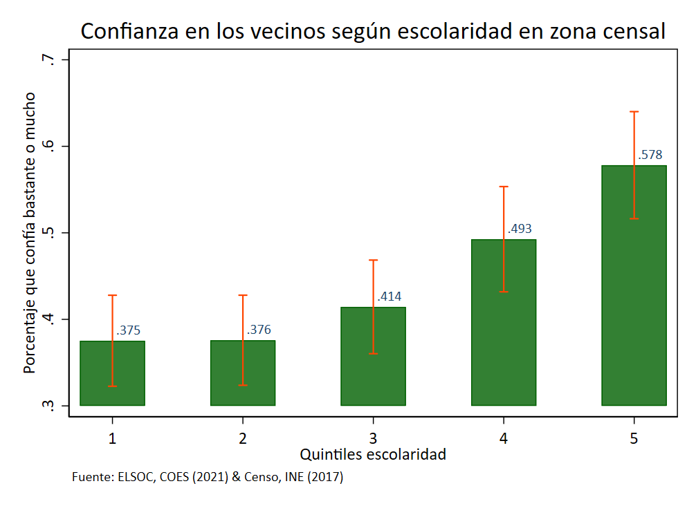

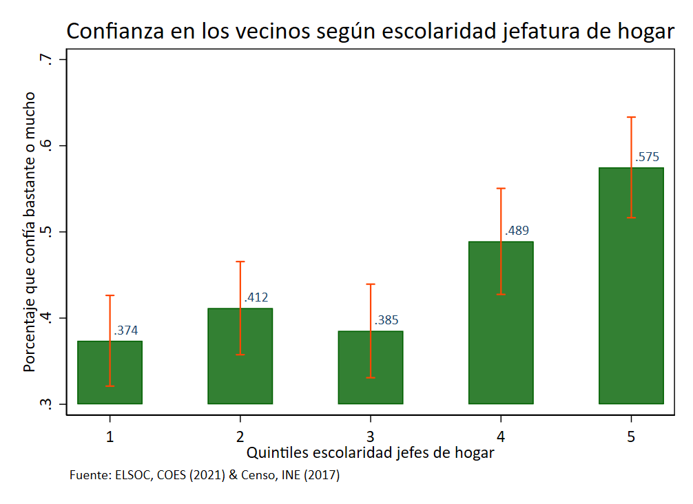
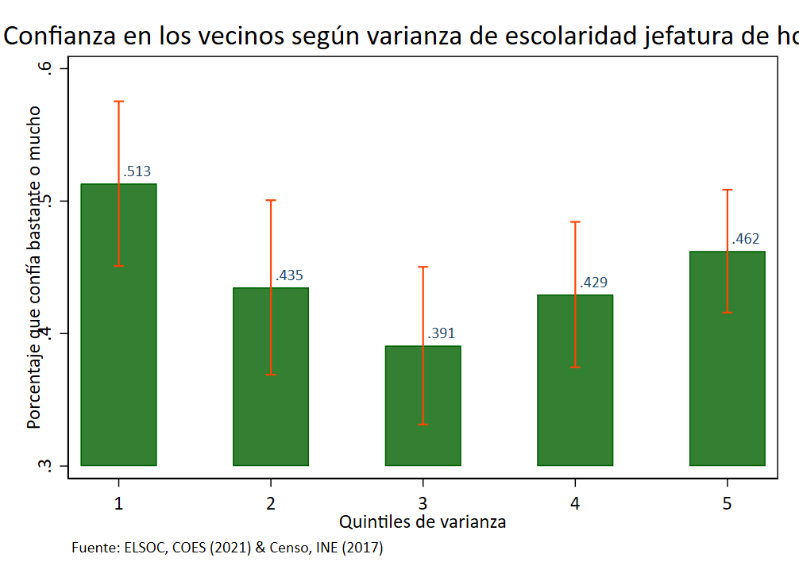

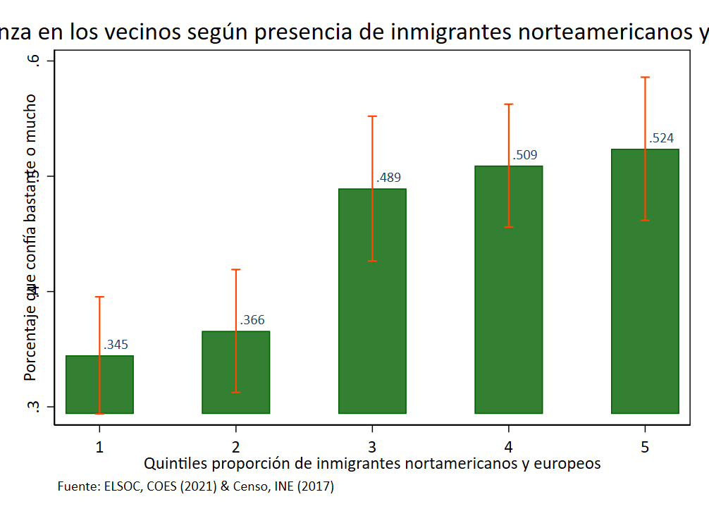
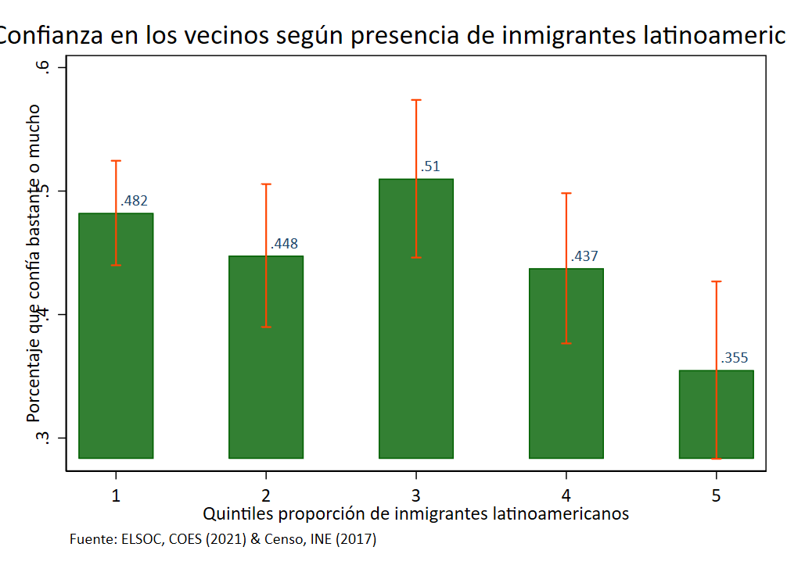
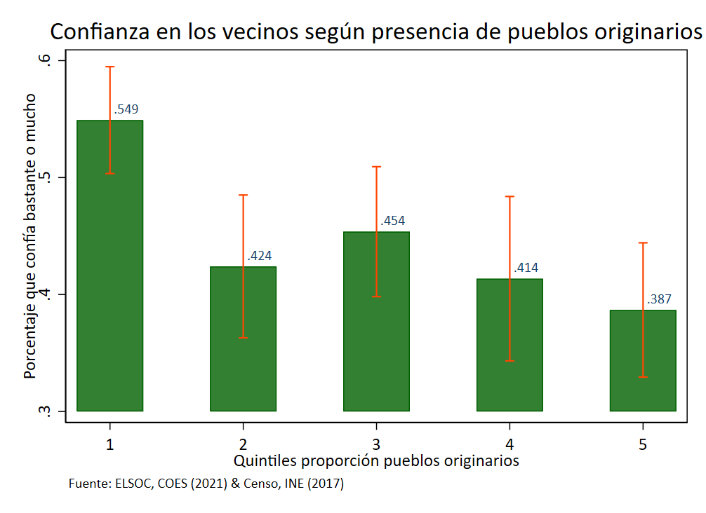
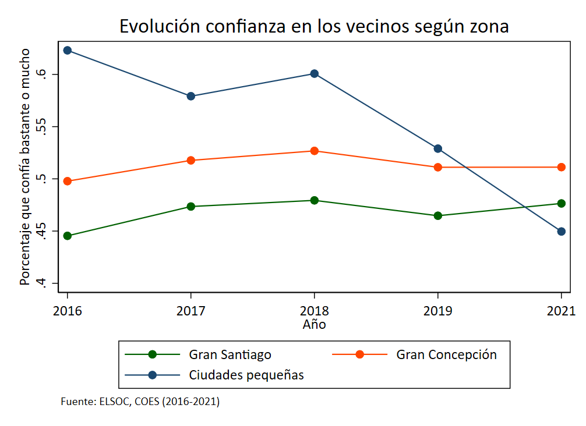

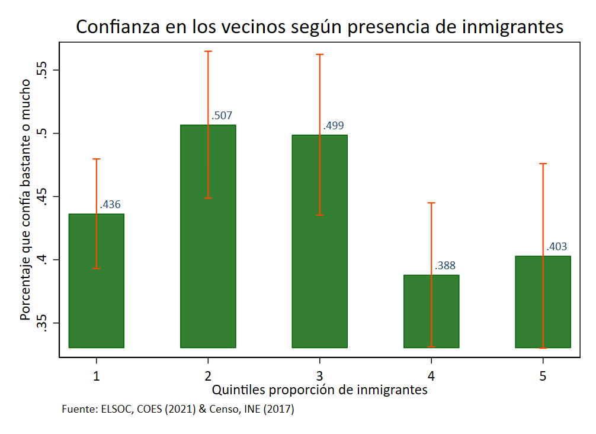
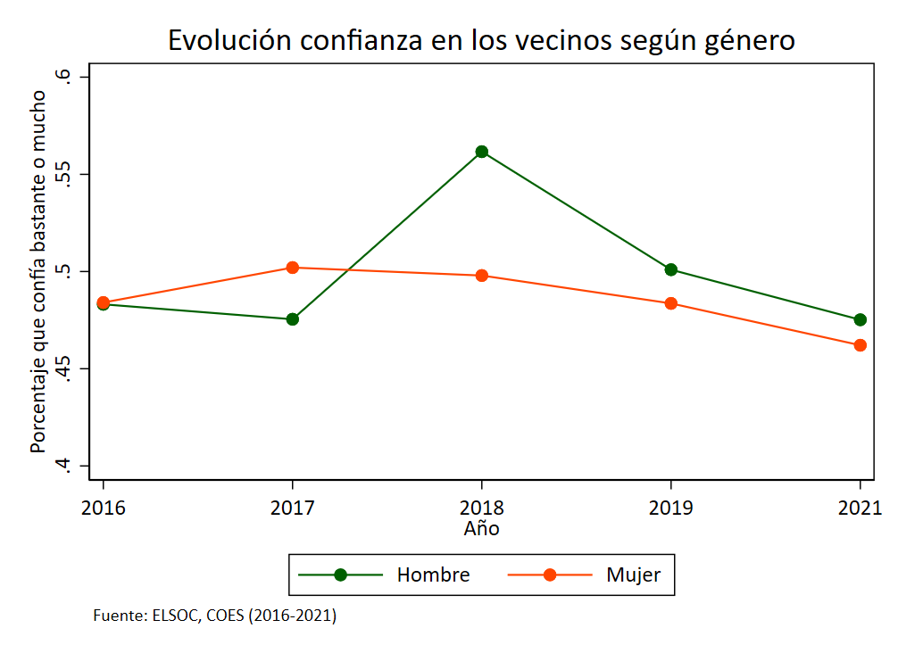
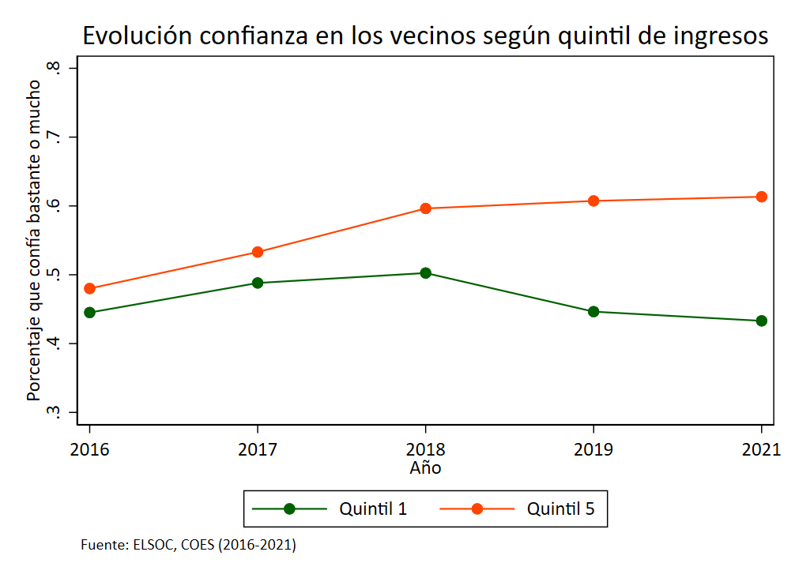
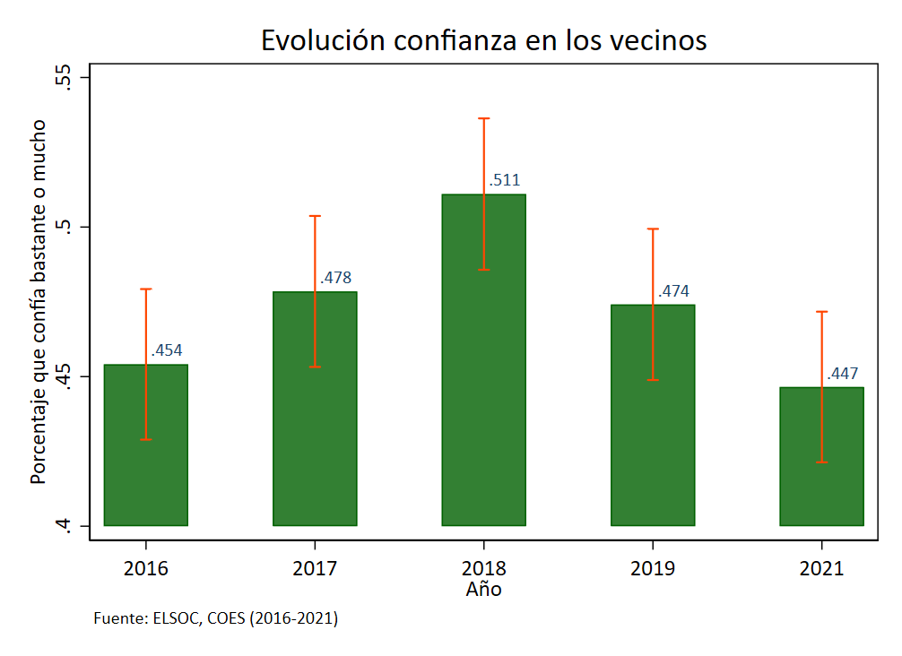


